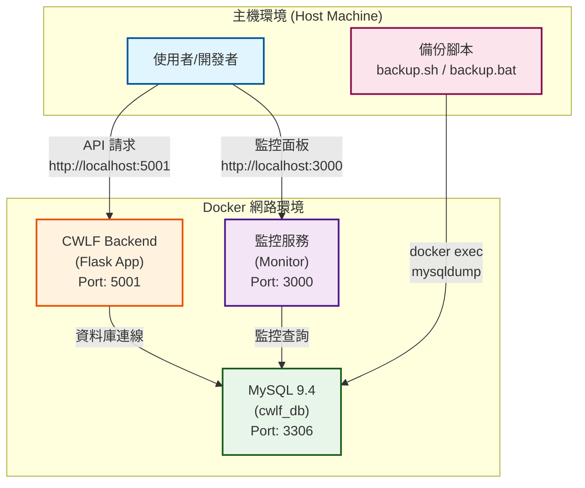

# 兒福聯盟後端系統 (CWLF Backend Project)


基於 Flask 框架與 Docker 容器化技術建構的後端服務系統，旨在為「兒福聯盟」提供一個穩固、可擴展且易於維護的後端基礎設施。

## ✨ 專案特色

- 🐳 **完全容器化** - 應用程式運行在獨立的 Docker 容器中，確保環境一致性
- 🚀 **快速部署** - 使用預先建置的 Docker 映像檔，可快速啟動服務
- 💾 **自動化備份** - 支援 Linux/Windows 平台的自動化資料庫備份
- 📅 **排程備份** - Linux 使用 cron，Windows 使用 Task Scheduler
- 🔄 **災難復原** - 提供標準化的資料庫還原腳本
- 🏥 **健康檢查** - 內建容器健康檢查機制
- 📊 **監控面板** - 整合監控服務（可選）
- 🔧 **易於擴展** - 架構設計支援未來添加更多服務

## 📋 目錄

- [系統架構](#系統架構)
- [技術棧](#技術棧)
- [目錄結構](#目錄結構)
- [前置需求](#前置需求)
- [快速開始](#快速開始)
- [備份與還原](#備份與還原)
  - [Linux/macOS 備份](#linuxmacos-備份)
  - [Windows 備份](#windows-備份)
  - [資料庫還原](#資料庫還原)
- [監控與維運](#監控與維運)
- [疑難排解](#疑難排解)

## 🏗️ 系統架構



## 🛠️ 技術棧

| 組件 | 技術/映像檔 | 版本 | 用途 |
|------|------------|------|------|
| **後端框架** | Flask | - | Python Web 框架 |
| **後端應用** | jp05451/cwlf-backend | latest | 主要業務邏輯 |
| **資料庫** | MySQL | 9.4.0 | 資料持久化 |
| **監控服務** | jp05451/cwlf-backend-monitor | latest | 系統監控 |
| **容器編排** | Docker Compose | v3.8 | 服務管理 |
| **備份工具** | mysqldump | - | 資料庫備份 |

## 📁 目錄結構

```
cwlf-backend/
├── cwlf_web/              # Flask 後端應用程式碼
│   ├── app/               # 應用程式主體
│   ├── config.py          # 配置檔
│   └── main.py            # 程式入口
├── cwlf_monitor/          # 監控服務程式碼
├── backups/               # 資料庫備份存放目錄 (自動生成)
├── .env                   # 環境變數配置
├── docker-compose.yml     # Docker Compose 配置
├── backup.sh              # Linux/macOS 備份腳本
├── backup.bat             # Windows 備份腳本
├── restore.sh             # Linux/macOS 還原腳本
├── restore.bat            # Windows 還原腳本
├── install_task.bat       # Windows 排程安裝腳本
├── uninstall_task.bat     # Windows 排程解除安裝腳本
└── README.md              # 本文件
```

## 📦 前置需求

請確保您的系統已安裝以下軟體：

### 基本需求
- **Docker Engine** (版本 20.10+)
- **Docker Compose** (版本 2.0+)

### Windows 額外需求
- **PowerShell** 5.0+ (用於壓縮備份)
- **系統管理員權限** (用於安裝排程任務)

### 驗證安裝

```bash
# 檢查 Docker 版本
docker --version

# 檢查 Docker Compose 版本
docker compose version

# 檢查 Docker 服務狀態
docker info
```

## 🚀 快速開始

### 1. 環境設定

```bash
# 克隆專案（如果需要）
git clone <repository-url>
cd cwlf-backend

# 確認 .env 檔案存在並配置正確
cat .env
```

`.env` 檔案範例：
```env
MYSQL_ROOT_USER=root
MYSQL_ROOT_PASSWORD=your_secure_password
```

### 2. 啟動服務

```bash
# 啟動所有服務
docker compose up -d

# 查看啟動狀態
docker compose ps

# 查看啟動日誌
docker compose logs -f
```

### 3. 驗證服務

服務啟動後，可透過以下端點訪問：

| 服務 | URL | 說明 |
|------|-----|------|
| **後端 API** | http://localhost:5001 | Flask 應用程式 |
| **監控面板** | http://localhost:3000 | 系統監控介面 |
| **MySQL** | localhost:3306 | 資料庫連線 |

### 4. 停止服務

```bash
# 停止服務但保留資料
docker compose down

# 停止服務並刪除所有資料（危險操作！）
docker compose down -v
```

## 💾 備份與還原

### Linux/macOS 備份

#### 手動執行備份

```bash
# 賦予執行權限（首次執行）
chmod +x backup.sh

# 執行備份
./backup.sh
```

#### 設定自動排程備份（cron）

```bash
# 編輯 crontab
crontab -e

# 添加以下排程（根據需求調整）
# 每天凌晨 2:00 自動備份
0 2 * * * /home/jp05451/cwlf-backend/backup.sh >> /home/jp05451/cwlf-backend/backups/backup.log 2>&1
```

**常見 cron 排程範例：**
```bash
# 每天凌晨 2:00
0 2 * * *

# 每 6 小時
0 */6 * * *

# 每週日凌晨 3:00
0 3 * * 0

# 每個月 1 號凌晨 4:00
0 4 1 * *
```

### Windows 備份

#### 手動執行備份

1. 雙擊 `backup.bat` 或在命令提示字元中執行：
```batch
backup.bat
```

#### 設定自動排程備份（Task Scheduler）

1. **右鍵點擊** `install_task.bat`
2. 選擇「**以系統管理員身分執行**」
3. 按照提示選擇排程選項：
   - **選項 1**: 每天凌晨 2:00 執行（推薦）
   - **選項 2**: 每週日凌晨 2:00 執行
   - **選項 3**: 每 12 小時執行一次
   - **選項 4**: 自訂時間

#### 管理排程任務

```batch
# 查看排程任務狀態
schtasks /Query /TN "MySQL_Daily_Backup" /V /FO LIST

# 手動執行排程任務
schtasks /Run /TN "MySQL_Daily_Backup"

# 停用排程任務
schtasks /Change /TN "MySQL_Daily_Backup" /DISABLE

# 啟用排程任務
schtasks /Change /TN "MySQL_Daily_Backup" /ENABLE

# 刪除排程任務（或執行 uninstall_task.bat）
schtasks /Delete /TN "MySQL_Daily_Backup" /F
```

### 備份特性

- ✅ **自動壓縮**: Linux 使用 gzip，Windows 使用 zip
- ✅ **自動清理**: 自動刪除 7 天前的舊備份
- ✅ **狀態檢查**: 執行前檢查容器是否運行
- ✅ **錯誤處理**: 完整的錯誤檢查和提示
- ✅ **時間戳記**: 備份檔案格式 `mysql_backup_YYYYMMDD_HHMMSS.sql.gz/.zip`

### 資料庫還原

⚠️ **危險操作警告**：
- 還原操作會**完全覆寫現有資料庫**，無法復原！
- 還原前**強烈建議**先執行一次備份作為保險
- 還原後需要重啟相關容器以確保變更生效

#### 查看可用備份

**Linux/macOS:**
```bash
# 列出所有可用的備份檔案
./restore.sh
```

**Windows:**
```batch
# 方式 1: 直接執行 restore.bat（不帶參數）
restore.bat

# 方式 2: 手動查看 backups 目錄
dir backups
```

#### 執行還原

**Linux/macOS:**
```bash
# 1. 賦予執行權限（首次執行）
chmod +x restore.sh

# 2. 執行還原（支援 .sql、.sql.gz 格式）
./restore.sh mysql_backup_20250107_020000.sql.gz

# 或使用完整路徑
./restore.sh ./backups/mysql_backup_20250107_020000.sql.gz
```

**Windows:**
```batch
# 執行還原（支援 .sql、.sql.gz、.zip 格式）
restore.bat mysql_backup_20250107_020000.zip

# 或使用完整路徑
restore.bat .\backups\mysql_backup_20250107_020000.zip

# 腳本會自動處理解壓縮，無需手動解壓
```

#### 還原流程說明

1. **列出可用備份** - 如果不帶參數執行，會列出所有可用的備份檔案
2. **檢查容器狀態** - 確認 MySQL 容器正在運行
3. **確認操作** - 顯示警告訊息，需輸入 `yes` 確認
4. **自動解壓縮** - 如果是壓縮檔（.gz/.zip），自動解壓縮
5. **導入資料** - 將 SQL 檔案導入資料庫
6. **清理臨時檔** - 自動清理解壓縮產生的臨時檔案
7. **提示後續動作** - 顯示建議的驗證和重啟步驟

#### 還原後驗證

```bash
# 1. 檢查資料庫表格是否正確還原
docker exec -it mysql_db mysql -uroot -p密碼 -e "USE cwlf_db; SHOW TABLES;"

# 2. 檢查資料筆數
docker exec -it mysql_db mysql -uroot -p密碼 -e "USE cwlf_db; SELECT COUNT(*) FROM your_table;"

# 3. 重啟應用容器
docker compose restart cwlf-backend

# 4. 查看應用日誌確認正常運行
docker compose logs -f cwlf-backend
```

### 備份最佳實踐

1. ✅ **定期備份**: 建議每天至少備份一次
2. ✅ **異地備份**: 定期將 `backups/` 目錄同步到其他伺服器或雲端儲存
3. ✅ **測試還原**: 每月至少測試一次還原流程
4. ✅ **監控備份**: 檢查備份日誌確保備份成功
5. ✅ **保留策略**:
   - 每日備份保留 7 天
   - 每週備份保留 4 週
   - 每月備份保留 12 個月

## 📊 監控與維運

### 檢查服務狀態

```bash
# 查看所有容器狀態
docker compose ps

# 查看容器詳細資訊
docker compose ps -a

# 查看容器資源使用情況
docker stats
```

### 查看服務日誌

```bash
# 查看所有服務日誌
docker compose logs

# 查看特定服務的即時日誌
docker compose logs -f cwlf-backend
docker compose logs -f mysql_db

# 查看最近 N 行日誌
docker compose logs --tail=100 cwlf-backend

# 查看帶時間戳的日誌
docker compose logs -t cwlf-backend
```

### 健康檢查

系統內建健康檢查機制：

```bash
# 查看容器健康狀態
docker inspect mysql_db --format='{{.State.Health.Status}}'
docker inspect cwlf-backend-monitor --format='{{.State.Health.Status}}'

# 查看健康檢查日誌
docker inspect mysql_db --format='{{json .State.Health}}' | jq
```

健康狀態說明：
- `starting` - 啟動中，尚未完成首次檢查
- `healthy` - 健康，服務正常運行
- `unhealthy` - 不健康，檢查失敗

### 重新啟動服務

```bash
# 重啟單一服務
docker compose restart cwlf-backend

# 重啟所有服務
docker compose restart

# 完全重建並啟動
docker compose down
docker compose up -d --build
```

### 更新映像檔

```bash
# 拉取最新映像檔
docker compose pull

# 停止舊服務
docker compose down

# 啟動新版本
docker compose up -d

# 清理未使用的映像檔
docker image prune -a
```

### 進入容器除錯

```bash
# 進入後端容器
docker exec -it cwlf-backend bash

# 進入 MySQL 容器
docker exec -it mysql_db bash

# 直接執行 MySQL 客戶端
docker exec -it mysql_db mysql -uroot -p
```

## 🔧 進階配置

### 擴展服務

`docker-compose.yml` 中包含已註解的服務配置：
- MySQL 資料庫（已啟用）
- RabbitMQ 消息佇列（已註解）
- 監控服務（已啟用）

如需啟用 RabbitMQ，請取消相關註解並配置環境變數。


## ❓ 疑難排解

### 問題 1: 端口衝突

**症狀**: 啟動失敗，提示端口已被占用

**解決方案**:
```bash
# 檢查端口占用情況
# Linux/macOS
lsof -i :5001
lsof -i :3306

# Windows
netstat -ano | findstr :5001
netstat -ano | findstr :3306

# 修改 docker-compose.yml 中的端口映射
ports:
  - "5002:5001"  # 將主機端口改為 5002
```

### 問題 2: 容器無法啟動

**症狀**: `docker compose up -d` 失敗

**診斷步驟**:
```bash
# 1. 檢查 Docker 服務
docker info

# 2. 查看詳細錯誤日誌
docker compose logs

# 3. 檢查配置檔語法
docker compose config

# 4. 檢查磁碟空間
df -h
```

### 問題 3: 健康檢查失敗

**症狀**: 容器狀態顯示 `unhealthy`

**解決方案**:
```bash
# 查看健康檢查日誌
docker inspect mysql_db --format='{{json .State.Health}}' | jq

# 手動執行健康檢查命令
docker exec mysql_db mysqladmin ping -h localhost -u帳號 -p密碼

# 增加健康檢查的寬限期（修改 docker-compose.yml）
healthcheck:
  start_period: 60s  # 增加啟動寬限期
  retries: 5         # 增加重試次數
```

### 問題 4: 備份腳本失敗

**Linux/macOS 常見問題**:
```bash
# 權限問題
chmod +x backup.sh

# 找不到 docker 命令
which docker
# 將 docker 路徑添加到 PATH 或在 crontab 中指定完整路徑

# cron 環境變數問題
# 在 crontab 最上方添加：
PATH=/usr/local/bin:/usr/bin:/bin
```

**Windows 常見問題**:
```batch
REM 檢查 Docker 是否在 PATH 中
where docker

REM 檢查 PowerShell 版本
powershell -Command "$PSVersionTable.PSVersion"

REM 以系統管理員身份執行
REM 右鍵 -> 以系統管理員身分執行
```

### 問題 5: 映像檔拉取失敗

**症狀**: `docker pull` 失敗

**解決方案**:
```bash
# 檢查網路連線
ping docker.io

# 檢查 Docker Hub 登入狀態
docker login

# 使用國內鏡像（中國大陸用戶）
# 編輯 /etc/docker/daemon.json
{
  "registry-mirrors": [
    "https://mirror.ccs.tencentyun.com"
  ]
}

# 重啟 Docker 服務
sudo systemctl restart docker
```

### 問題 6: 資料庫連線失敗

**症狀**: 後端無法連接到 MySQL

**診斷步驟**:
```bash
# 1. 檢查 MySQL 容器狀態
docker compose ps mysql_db

# 2. 檢查網路連接
docker exec cwlf-backend ping mysql_db

# 3. 測試資料庫連線
docker exec mysql_db mysql -uroot -p密碼 -e "SELECT 1"

# 4. 檢查環境變數
docker exec cwlf-backend env | grep MYSQL
```

### 問題 7: 還原腳本失敗

**症狀**: restore.sh 或 restore.bat 執行失敗

**Linux/macOS 常見問題**:
```bash
# 權限問題
chmod +x restore.sh

# 壓縮檔損壞
gunzip -t backups/mysql_backup_20250107_020000.sql.gz

# 手動測試還原
gunzip -c backups/mysql_backup_20250107_020000.sql.gz | docker exec -i mysql_db mysql -uroot -p密碼 cwlf_db

# 檢查 SQL 檔案內容
gunzip -c backups/mysql_backup_20250107_020000.sql.gz | head -20
```

**Windows 常見問題**:
```batch
REM PowerShell 版本過舊（需要 5.0+）
powershell -Command "$PSVersionTable.PSVersion"

REM 手動解壓縮測試
powershell -Command "Expand-Archive -Path '.\backups\mysql_backup_20250107_020000.zip' -DestinationPath '.\backups\test'"

REM 檢查解壓縮後的檔案
dir .\backups\test

REM 手動還原測試
type .\backups\test\mysql_backup_20250107_020000.sql | docker exec -i mysql_db mysql -uroot -p密碼 cwlf_db
```

**通用解決方案**:
```bash
# 1. 確認備份檔案完整性
ls -lh backups/  # Linux/macOS
dir backups      # Windows

# 2. 確認容器運行中
docker ps | grep mysql_db

# 3. 確認資料庫可訪問
docker exec mysql_db mysql -uroot -p密碼 -e "SHOW DATABASES;"

# 4. 檢查磁碟空間
df -h  # Linux/macOS
dir    # Windows

# 5. 如果還是失敗，嘗試使用較舊的備份
```

## 📚 相關文件

- [環境規格書](環境規格書.md) - 詳細的環境規格說明
- [環境測試流程](環境測試流程.md) - 測試流程與檢查清單
- [環境測試報告](環境測試報告.md) - 測試結果與驗證報告

## 🤝 貢獻指南

歡迎提交 Issue 或 Pull Request 來改進本專案。

## 📄 授權

本專案由兒福聯盟內部使用。

## 📞 聯絡資訊

如有問題或建議，請聯絡開發團隊。

---

**Last Updated**: 2025-11-07
**Maintained by**: CWLF Development Team
