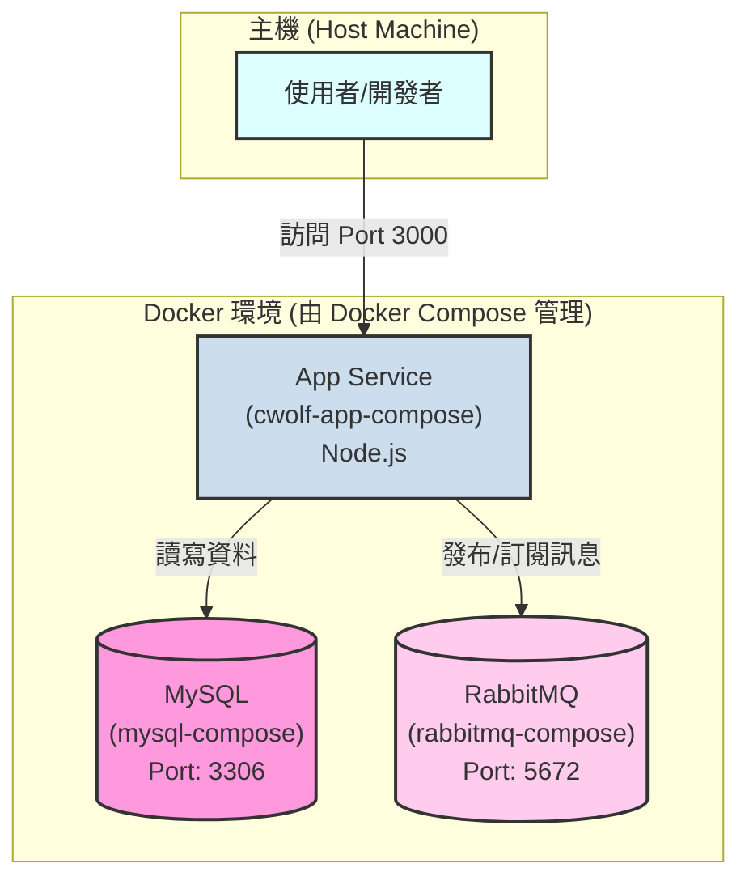

# 兒福聯盟後端系統 (CWLF Backend Project)


這是一個使用 Docker 容器化技術建構的後端服務系統範本，旨在為「兒福聯盟」提供一個穩固、可擴展且易於維護的後端基礎設施。

本專案不僅是一個可運行的應用，更是一個完整的 DevOps 實踐範例，涵蓋了從開發、測試、部署到監控與備份的完整生命週期。

## 專案特色

*   **完全容器化**：所有服務 (應用程式, 資料庫, 消息佇列) 均運行在獨立的 Docker 容器中，確保環境一致性。
*   **多環境管理**：使用 `docker-compose.yml` 和 `docker-compose.uat.yml` 分別管理 `dev` (開發) 與 `uat` (測試) 環境。
*   **高可用性設計**：內建自動健康檢查 (`healthcheck`) 與服務依賴啟動順序，確保系統穩定。
*   **自動化備份**：提供自動化資料庫備份腳本，並可透過 `cron` 進行排程。
*   **災難備援演練**：提供標準化的資料庫還原腳本，可用於災難備援。

## 系統架構圖



## 技術棧 (Tech Stack)

| 組件 (Component)    | 軟體/映像檔 (Image)                    | 版本          |
| ------------------- | -------------------------------------- | ------------- |
| **應用程式框架**    | Node.js                                | `18-alpine`   |
| **資料庫**          | MySQL Server                           | `9.4.0`         |
| **消息佇列**        | RabbitMQ                               | `4-management`|
| **部署與編排**      | Docker / Docker Compose                | 最新版本      |

## 目錄結構

```
cwlf-backend/
├── app/                  # 後端應用程式原始碼
│   ├── Dockerfile        # 應用程式的容器建置說明檔
│   └── ...
├── backups/              # (自動生成) 資料庫備份存放目錄
├── backup.sh             # 自動化備份腳本
├── restore.sh            # 手動還原腳本
├── docker-compose.yml    # 基礎與開發環境定義檔
├── docker-compose.uat.yml # UAT 環境差異化定義檔
└── README.md             # 就是本文件
```

## 前置需求

請確保您的系統已安裝以下軟體：
1.  **Docker Engine**
2.  **Docker Compose** 

## 快速開始 (Quick Start)

### 1. 開發環境 (`dev`)

這是開發者日常使用的環境。它會從本地 `app` 目錄下的原始碼直接建置應用程式容器。

```bash
# 第一次啟動或程式碼有更動時，使用 --build
docker compose up --build -d

# 一般啟動
docker compose up -d
```

啟動後，可以透過以下端點訪問服務：
*   **後端應用 API**: `http://localhost:3000`
*   **應用健康檢查**: `http://localhost:3000/health`
*   **RabbitMQ 管理介面**: `http://localhost:15672` (帳號/密碼: guest/guest)

若要停止開發環境：
```bash
docker compose down
```

### 2. 使用者驗收測試環境 (`uat`)

UAT 環境模擬正式環境，它會從 Docker Hub 拉取一個**已發布的、特定版本**的映像檔來運行，而不是從本地建置。

```bash
# 使用 -f 旗標來組合基礎與 UAT 配置
docker compose -f docker-compose.yml -f docker-compose.uat.yml up -d
```

UAT 環境的服務端點：
*   **後端應用 API**: `http://localhost:8080`
*   **RabbitMQ 管理介面**: `http://localhost:15672`

停止 UAT 環境：
```bash
docker compose -f docker-compose.yml -f docker-compose.uat.yml down
```

## 監控與維運

### 檢查服務健康狀況

使用以下指令可以快速查看所有服務的即時狀態。正常的服務會顯示 `(healthy)`。

```bash
docker compose ps
```

### 查看服務日誌

若要排查特定服務的問題，查看其日誌是最好的方法。

```bash
# 查看 app 服務的即時日誌
docker compose logs -f app

# 查看 mysql_db 服務的所有日誌
docker compose logs mysql_db
```

## 備份與還原

### 自動化備份

`backup.sh` 腳本可以備份 `mysql_db` 服務中的所有資料庫。

```bash
# 賦予執行權限 (僅需執行一次)
chmod +x backup.sh

# 執行備份
./backup.sh```
備份檔案會以時間戳命名，並存放在 `backups/` 目錄下。可以設定 `cron` 排程來實現全自動備份。

### 資料庫還原

`restore.sh` 腳本可以將指定的 `.sql` 備份檔還原至資料庫。**此操作會覆寫現有資料，請謹慎使用！**

```bash
# 賦予執行權限 (僅需執行一次)
chmod +x restore.sh

# 執行還原
./restore.sh ./backups/backup-XXXXXX.sql
```